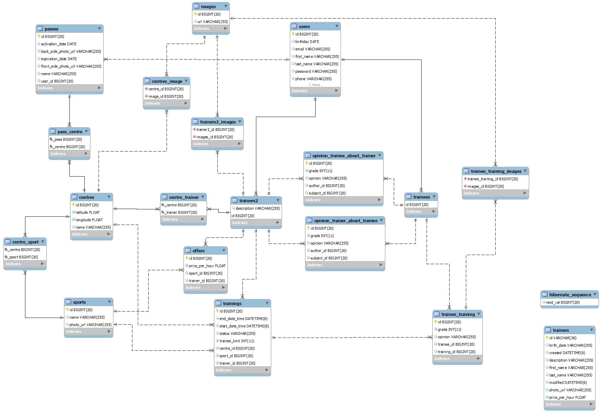
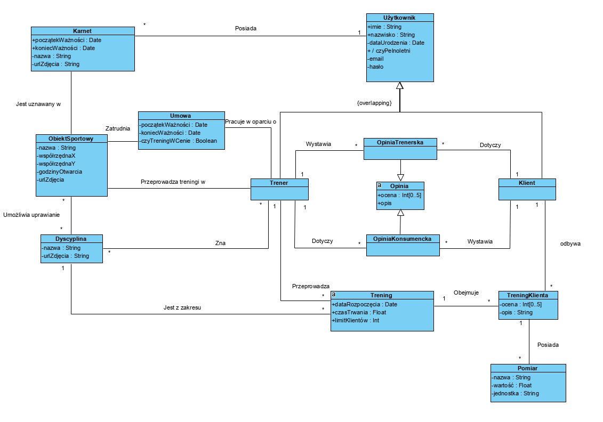

# TrainingPlatformSpring
Spring Boot application for university project.

## Database
App uses Google Cloud Platform (GCP) Google Cloud instance with MySQL 5.7 DBMS.

To connect to database:
1. Set GOOGLE_APPLICATION_CREDENTIALS  enviromental variable to location of the private key generated and downloaded from Google Cloud Console.
2. Add your public IP to Cloud SQL instance's whitelist to allow network trafic.

## Entity Relationship Diagram
Diagram generated in MySQL Workbench based on tables created by Hibernate ORM.

## Class diagram
Although the diagram is written in Polish, all entities, attributes and methods will be named in English.

